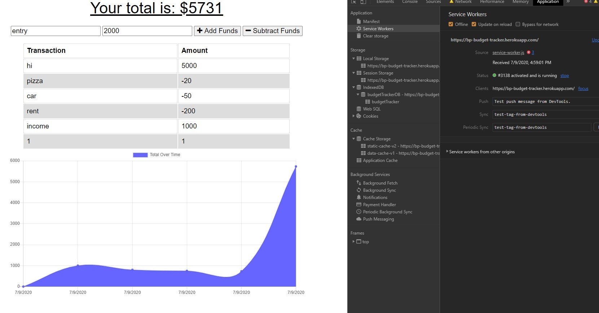

# Online/Offline Budget Trackers

[budget tracker app](https://bp-budget-tracker.herokuapp.com/)

.

This app allows you to track your deposits and expenses over time.   It has the functionality to store your data online and when you are offline, it will cache those entries and store them when you get back online.  

## User Story
AS AN avid traveller, I WANT to be able to track my withdrawals and deposits with or without a data/internet connection
SO THAT my account balance is accurate when I am traveling

##  Future Development
* add a "delete transaction" button
* roll up transactions by days, weeks, months
